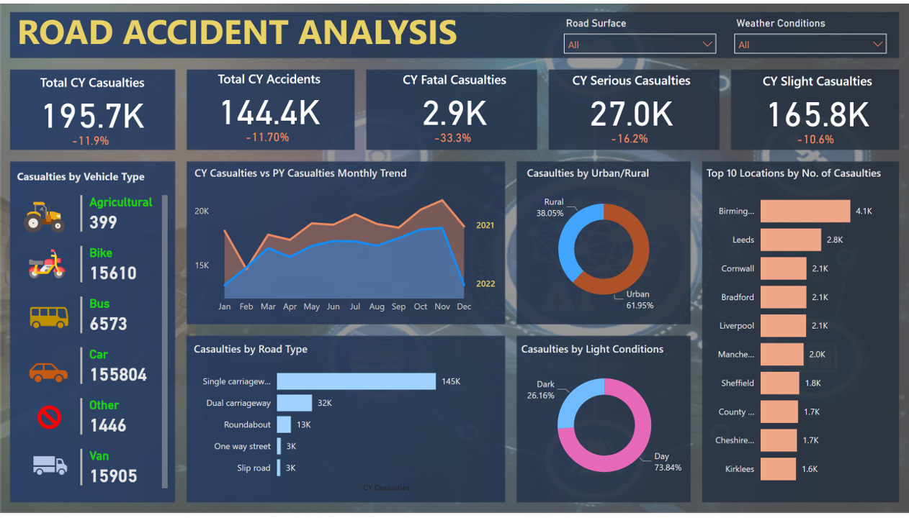

# Road Accident Analysis PowerBI
The Road Accident Analysis Dashboard is a comprehensive visual tool designed to provide insights and facilitate informed decision-making regarding road safety measures. Developed using Power BI, this dashboard amalgamates data from various sources to offer a holistic view of road accidents, their causes, and associated trends.

Key Features:
1. Vehicle Type and Impact Analysis:
   This feature enables users to analyze the types of vehicles involved in accidents and their impact on severity. Insights into collision dynamics, such as vehicle size, speed, and angle of impact, aid in devising    vehicle safety standards and infrastructure improvements.
   
2. Weather and Road Conditions Impact:
 By integrating weather and road condition data, the dashboard evaluates the influence of environmental factors on accident rates. Users can assess correlations between weather patterns, road conditions, and         accident severity to enhance preparedness and response strategies.

3. Accident Trends: Through intuitive charts and graphs, the dashboard presents trends in accident occurrence over time. Users can identify patterns, seasonal variations, and emerging trends to allocate resources       effectively and implement preventive measures.
